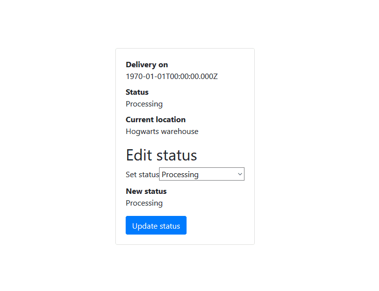

# Elm shipping app example

Example shipping app for modeling odd-shaped data in Elm.

## Development

1. Clone the project
2. Run `npm run watch` to build and watch for changes
3. Run `npm run start` to serve app at http://localhost:8082/index.html
4. Check out the code in `src/Main.elm`

## In action

